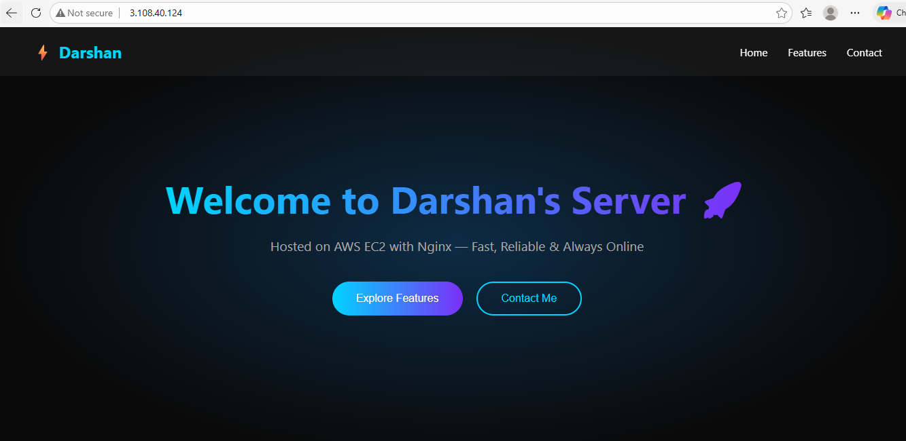
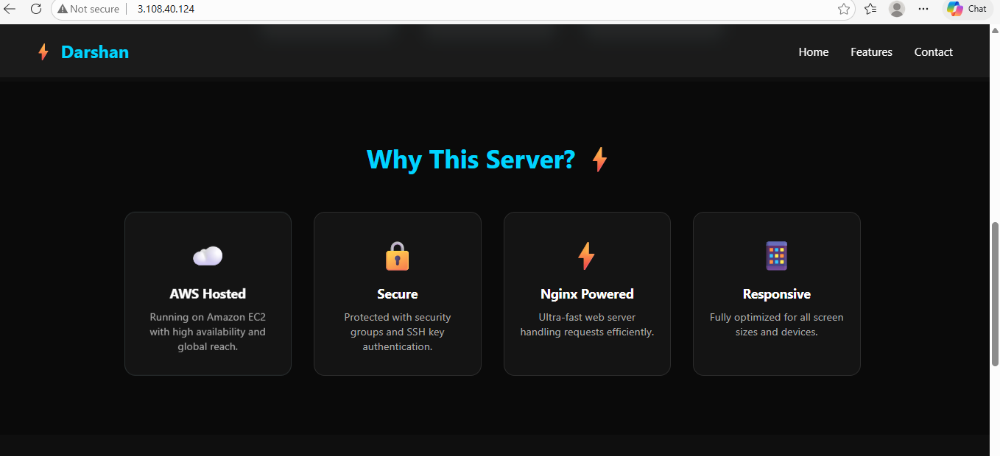
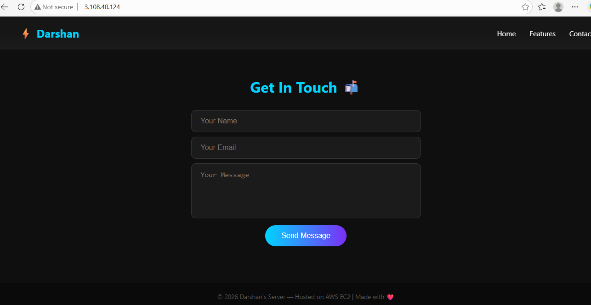

# Darshan-aws-projects
simple aws projects used in real world 
# 🚀 AWS EC2 Nginx Website Project


## 📌 Project Overview
A static website deployed on **AWS EC2** using **Nginx** web server on **Ubuntu Linux**.

## 🌍 Live URL
👉 http://3.109.181.239

## 🛠️ Tech Stack
| Technology | Usage |
|---|---|
| AWS EC2 | Cloud Server |
| Ubuntu Linux | Operating System |
| Nginx | Web Server |
| HTML/CSS/JS | Frontend |

## 📸 Screenshots

### 🏠 Home Page


### ⚡ Features Section


### 📬 Contact Form


## ⚙️ Setup Steps
1. Launch EC2 instance on AWS
2. Connect via SSH
3. Install Nginx
```bash
sudo apt update
sudo apt install nginx -y
```
4. Deploy website files to `/var/www/html/`
5. Start Nginx
```bash
sudo systemctl start nginx
sudo systemctl enable nginx
```

## 📚 What I Learned
- Launching and configuring AWS EC2
- Setting up Nginx web server on Ubuntu
- Deploying static websites on cloud
- Managing Linux server with terminal commands
- SSH connection and file permissions

## 👨‍💻 Author
**Darshan Chikane**
- GitHub: [@Darshan-tester](https://github.com/Darshan-tester)

---
⭐ If you like this project, give it a star!
